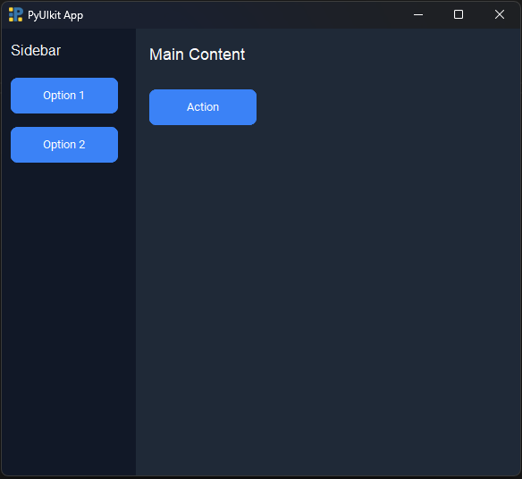

## Div Component

A `Div` in PyUIkit is like a **box or container** that can hold other UI components such as `Text`, `Button`, or `Input`.  
Think of it like a section on a webpage where you can put things together to organize your interface neatly.

**Divs DO NOT auto stack therefore you are required to give x and y coordinates to the divs for the desired position**

components inside a div auto stack vertically. They can still be manually positioned by their own x and y coordinates if needed 

> ⚠️ **Note:** Before using this component, it is recommended to read the [Quickstart Guide](https://github.com/Huzaifa-Atiq/PyUIkit/blob/main/documentation/Quickstart.md) if you haven't already to understand how to create windows, top-level Divs, and basic setup.


### Nested Divs
Sometimes you may want a **Div inside another Div** — for example, a small card inside a bigger container.  
This is called a **nested Div**. To create one, just use the parameter `nested=True` when making the inner Div.  

- The inner Div will appear **inside the outer Div**.  
- You can put any components inside the nested Div just like a normal Div.  
- You can also have multiple levels of Divs inside each other if needed.  
- x and y coordinates should be specified for a specific position

---

### Features

- Groups UI components together  
- Can hold other Divs as **nested Divs**  
- Customizable background color, width, height, and padding  
- Optional `id` for referencing the Div in your code  

---

### Parameters

| Parameter  | Type        | Default      | Description |
|------------|------------|-------------|-------------|
| `children` | `list`     | `[]`        | Components inside this Div (Text, Button, Input, or Div with nested=True) |
| `parent`   | `Component`  | `None`      | Parent container (auto-attaches to window if top-level) |
| `bg_color` | `str`      | `#FFFFFF`   | Background color |
| `padding`  | `int`      | `0`         | Space around child components |
| `id`       | `str`      | `None`      | Optional unique identifier |
| `width`    | `int`      | `100`       | Width in pixels |
| `height`   | `int`      | `100`       | Height in pixels |
| `x`        | `int`      | `None`      | Left position on screen |
| `y`        | `int`      | `None`      | Top position on screen |
| `nested`   | `bool`     | `False`     | Whether this Div is nested inside another Div |
| `Horizontal`   | `bool`     | `False`     | Whether this Div should stack its components vertically or horizontally |

---

Sure! Here's a cleaner and more concise version of your note with a polished explanation:

---

## Note ⚠️:

* Components inside a `Div` **auto-stack** if no `x` or `y` positions are provided.
* The stacking **direction** is controlled by the `horizontal` parameter:

  * `horizontal=True` → components are stacked **horizontally**
  * `horizontal=False` (default) → components are stacked **vertically**

This allows you to create flexible, web-like layouts without manually specifying coordinates for every component.

---

### Example — Basic Div

```python
from pyuikit import Body, Div
from pyuikit.components import Text, Button

# Example 1 — Basic Div With Text
Div(
    x=50,
    y=50,
    width=400,
    height=300,
    bg_color="#eaeaea",
    padding=10,
    children=[
        Text(text="Hello inside a Div!", color="#333", font_size=18, id="innerText")
    ],
    id="mainDiv"
)
```

# Example 2 — Multiple Components Inside a Div
```python
def say_hi():
    Text.set_text(id="status", new_text="Button clicked!")

Div(
    x=20,
    y=20,
    width=300,
    height=200,
    bg_color="#fafafa",
    padding=10,
    children=[
        Text(text="Click the button:", font_size=16),
        Button(text="Say Hi", on_click=say_hi),
        Text(text="", id="status", font_size=14, color="#444")
    ],
    id="interactiveDiv"
)
```

# Example 3 — Nested Divs

```python
Div(
    x=50,
    y=50,
    width=400,
    height=300,
    bg_color="#dcdcdc",
    padding=20,
    id="parentDiv",
    children=[
        Text(text="Parent Div", font_size=18, color="#222"),
        Div(
            width=200,
            height=100,
            bg_color="#bbbbbb",
            padding=10,
            nested=True,
            children=[
                Text(text="Nested Div Content", font_size=16, color="#111"),
                Button(text="Click Me")
            ],
            id="nestedDiv"
        )
    ]
)
```

# Example 4 — Full Window Layout With Divs
```python
Div(
    width=150,
    height=500,
    bg_color="#111827",
    padding=10,
    children=[
        Text(text="Sidebar", color="#f9fafb", font_size=16),
        Button(text="Option 1"),
        Button(text="Option 2")
    ],
    id="sidebar"
)

Div(
    width=430,
    height=500,
    bg_color="#1f2937",
    padding=15,
    nested=True,
    children=[
        Text(text="Main Content", color="#f9fafb", font_size=18),
        Button(text="Action")
    ],
    id="contentDiv"
)
```


# Example 5 — Horizontal Stacking

```python
Div(
    x=20,
    y=20,
    width=400,
    height=150,
    bg_color="#222",
    padding=15,
    horizontal=True,
    children=[
        Button(text="One"),
        Button(text="Two"),
        Button(text="Three")
    ]
)
```

# Div Methods

The `Div` class includes `dynamic` update helpers:

1. set_bg_color(id, color)

```python
Div.set_bg_color(id="mainDiv", color="#ff0000")
```

1. set_size(id, width, height)

```python
Div.set_size(id="mainDiv", width=300, height=150)
```

# Example 6 — Using Update Methods in an App

```python
def make_red():
    Div.set_bg_color("colorBox", "#ef4444")

def make_big():
    Div.set_size("colorBox", width=300, height=200)

Div(
    x=30,
    y=30,
    width=200,
    height=150,
    bg_color="gray",
    id="colorBox",
    children=[
        Button(text="Red", on_click=make_red),
        Button(text="Grow", on_click=make_big),
    ]
)
```