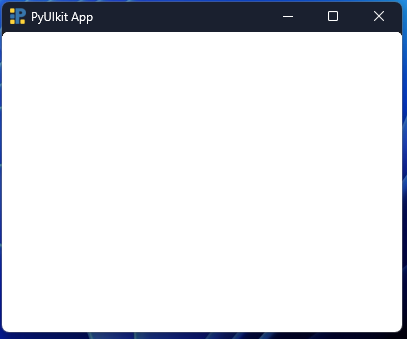
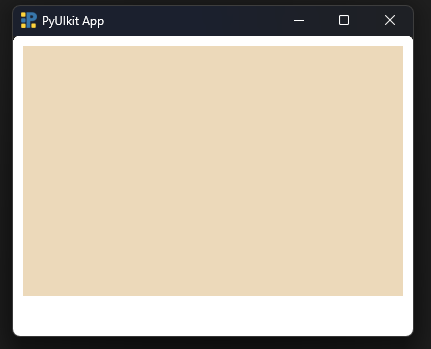
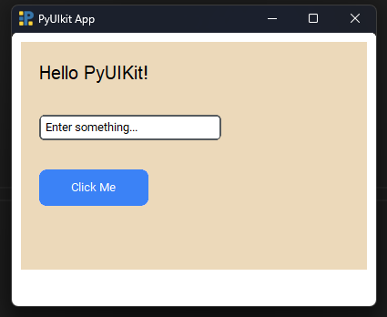
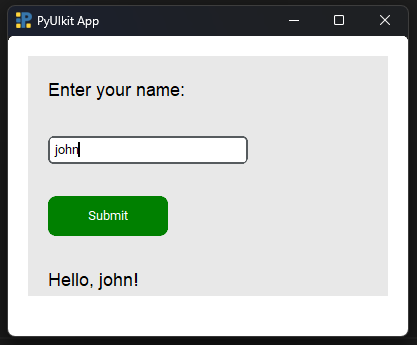

# Quickstart Guide

Welcome to **PyUIKit** — a lightweight, Python-based UI framework made for simplicity.  
This quickstart will walk you through your first steps, from installation to building your first app.

---

## Installation

Install PyUIKit using pip:

```bash
pip install pyuikit
```

## 1. Creating your first window

Every app starts with a `Body`, which represents your main window.

```python
from pyuikit import Body

app = Body(width=400, height=300, bg_color='white')
app.run()
```

This creates a blank window with the size and background color you choose.



## 2. Adding a Div (layout container)

A `Div` is like a section or container inside your window.

```python
from pyuikit import Body, Div

app = Body(width=400, height=300, bg_color='white')

Div(
    width=380,
    height=250,
    bg_color='#ecd9ba',
    x=10,
    y=10
)

app.run()
```

**At least one top-level Div is required. Components cannot be rendered outside a Div.**



## 3. Adding components inside a Div

You can place components like text, input fields, and buttons inside a `Div` using the `children` parameter.

```python
from pyuikit import Body, Div
from pyuikit.components import Text, Input, Button

app = Body(width=400, height=300, bg_color='white')

Div(
    width=380,
    height=250,
    bg_color='#ecd9ba',
    padding=20,
    x=10,
    y=10,
    children=[
        Text(text='Hello PyUIKit!', font_size=20),
        Input(placeholder='Enter something...'),
        Button(text='Click Me')
    ],
)

app.run()
```

`padding` adds space inside the Div so components don’t touch the edges or overlap each other.



## 4. Positioning components (x, y)

You can manually position components using `x` and `y`:

```python
Text(text='Title', x=10, y=10)
```

**But PyUIKit does not require x and y**

If you leave them out, components inside a `Div` automatically stack vertically in order.

This keeps layout simple unless you want manual control.

## 5. Building a complete small app

Let’s combine everything into a real working example — a tiny Name Display App.

```python
from pyuikit import Body, Div
from pyuikit.components import Text, Input, Button

def show_name():
    name = Input.get_input(id='name_input')
    Text.set_text(id='output', new_text=f'Hello, {name}!')

app = Body(width=400, height=300, bg_color='white')

Div(
    width=360,
    height=240,
    bg_color='#e8e8e8',
    padding=20,
    x=20,
    y=20,
    children=[
        Text(text='Enter your name:', font_size=18),
        Input(placeholder='Your name...', id='name_input'),
        Button(text='Submit', color='green', on_click=show_name),
        Text(text='', font_size=18, id='output')
    ]
)

app.run()
```



This app:

- Creates a window

- Adds a Div

- Adds text, input, and button

- Updates text dynamically using the id system

You’re now ready to explore the full library!


