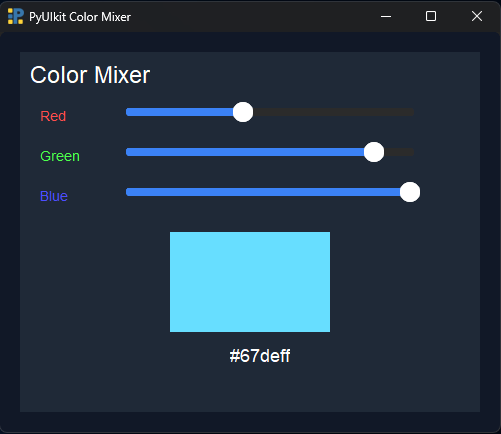

# PyUIkit Color Mixer Example

This is a simple **Color Mixer app** built using PyUIkit.  
It demonstrates how to use the `Div`, `Text`, and `Slider` components to create an interactive UI.

---

## Features

- Adjust **Red, Green, and Blue** channels individually using sliders.
- Real-time preview of the mixed color.
- Shows the **hex value** of the selected color dynamically.

---

## Components Used

- **Div**: Container for grouping components and setting backgrounds.
- **Text**: Displays static or dynamic text.
- **Slider**: Interactive component to choose numerical values (0–255 for RGB).

---

## How It Works

1. Each slider (`Red`, `Green`, `Blue`) is connected to its own update function.
2. When a slider changes:
   - The new value is taken from that slider.
   - The other two values are fetched from their sliders using `Slider.get_value()`.
   - The hex color is calculated and applied to the preview `Div`.
   - The hex value is displayed using the `Text` component.

---

## Code

```python
from pyuikit import Body, Div
from pyuikit.components import Text, Slider

app = Body(title="PyUIkit Color Mixer", width=500, height=400, bg_color="#111827")

# ----------------- Update Functions -----------------
def update_red(r):
    g = Slider.get_value("greenSlider")
    b = Slider.get_value("blueSlider")
    hex_color = f"#{int(r):02x}{int(g):02x}{int(b):02x}"
    Div.set_bg_color("colorPreview", hex_color)
    Text.set_text("hexLabel", hex_color)

def update_green(g):
    r = Slider.get_value("redSlider")
    b = Slider.get_value("blueSlider")
    hex_color = f"#{int(r):02x}{int(g):02x}{int(b):02x}"
    Div.set_bg_color("colorPreview", hex_color)
    Text.set_text("hexLabel", hex_color)

def update_blue(b):
    r = Slider.get_value("redSlider")
    g = Slider.get_value("greenSlider")
    hex_color = f"#{int(r):02x}{int(g):02x}{int(b):02x}"
    Div.set_bg_color("colorPreview", hex_color)
    Text.set_text("hexLabel", hex_color)

# ----------------- Main Div -----------------
Div(
    x=20,
    y=20,
    width=460,
    height=360,
    bg_color="#1f2937",
    padding=15,
    children=[
        Text(text="Color Mixer", font_size=24, color="#ffffff", x=10, y=10),

        Text(text="Red", x=20, y=50, color="#ff4d4d"),
        Slider(id="redSlider", x=100, y=50, width=300, height=20, min_value=0, max_value=255, on_change=update_red),

        Text(text="Green", x=20, y=90, color="#4dff4d"),
        Slider(id="greenSlider", x=100, y=90, width=300, height=20, min_value=0, max_value=255, on_change=update_green),

        Text(text="Blue", x=20, y=130, color="#4d4dff"),
        Slider(id="blueSlider", x=100, y=130, width=300, height=20, min_value=0, max_value=255, on_change=update_blue),

        Div(
            id="colorPreview",
            x=150,
            y=180,
            width=160,
            height=100,
            bg_color="#000000",
            children=[]
        ),

        Text(text="#000000", id="hexLabel", x=210, y=290, color="#ffffff", font_size=18)
    ]
)

app.run()
```

