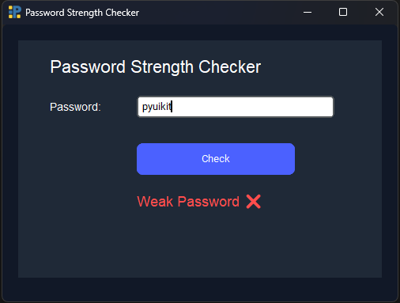
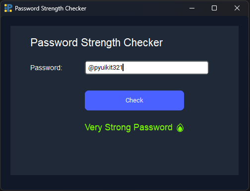

# PyUIkit Password Strength Checker Example

This is a simple **Password Strength Checker app** built using PyUIkit.
It demonstrates how to use the `Div`, `Text`, `Input`, and `Button` components to create an interactive UI.

---

## Features

* Enter a password and **check its strength**.
* Provides feedback: *Too short*, *Weak*, *Moderate*, *Strong*, or *Very Strong*.
* Shows feedback text in **different colors** for visual indication.

---

## Components Used

* **Div**: Container for grouping components and setting backgrounds.
* **Text**: Displays static or dynamic text.
* **Input**: Field for entering passwords.
* **Button**: Triggers the password check function.

---

## How It Works

1. User types a password into the `Input` component.
2. When the **Check** button is clicked:

   * The password is fetched using `Input.get_input(id="pwdInput")`.
   * Strength is calculated based on length, presence of digits, letters, and special characters.
   * `Text.set_text()` updates the feedback message.
   * `Text.set_color()` changes the color of the feedback message based on strength.

---

## Code

```python
from pyuikit import Body, Div
from pyuikit.components import Text, Input, Button

app = Body(title="Password Strength Checker", width=500, height=350, bg_color="#111827")

# ----------------- CHECK FUNCTION -----------------
def check_password():
    pwd = Input.get_input(id="pwdInput")
    strength = 0

    if len(pwd) >= 8:
        strength += 1
    if any(c.isdigit() for c in pwd):
        strength += 1
    if any(c.isalpha() for c in pwd):
        strength += 1
    if any(c in "!@#$%^&*()_+-=[]{};:,.<>?/" for c in pwd):
        strength += 1

    if strength == 0:
        Text.set_text("resultLabel", "Enter a password ❗")
        Text.set_color("resultLabel", "#ff4d4d")
    elif strength == 1:
        Text.set_text("resultLabel", "Weak Password ❌")
        Text.set_color("resultLabel", "#ff4d4d")
    elif strength == 2:
        Text.set_text("resultLabel", "Moderate Password ⚠️")
        Text.set_color("resultLabel", "#f5d76e")
    elif strength == 3:
        Text.set_text("resultLabel", "Strong Password 💪")
        Text.set_color("resultLabel", "#4dc3ff")
    elif strength == 4:
        Text.set_text("resultLabel", "Very Strong Password 🔥")
        Text.set_color("resultLabel", "#7CFC00")

# ----------------- UI -----------------
Div(
    x=20,
    y=20,
    width=460,
    height=300,
    bg_color="#1f2937",
    padding=20,
    children=[
        Text(text="Password Strength Checker", x=40, y=20, font_size=22, color="#ffffff"),

        Text(text="Password:", x=40, y=70, color="#ffffff"),
        Input(
            id="pwdInput",
            x=150,
            y=70,
            width=250,
            height=35,
            placeholder="Enter password..."
        ),

        Button(
            text="Check",
            x=150,
            y=130,
            width=200,
            height=40,
            color="#4b61ff",
            text_color="white",
            corner_radius=8,
            on_click=check_password
        ),

        Text(text="", id="resultLabel", x=150, y=190, font_size=18, color="#ffffff"),
    ]
)

app.run()
```

---


<br><br>

